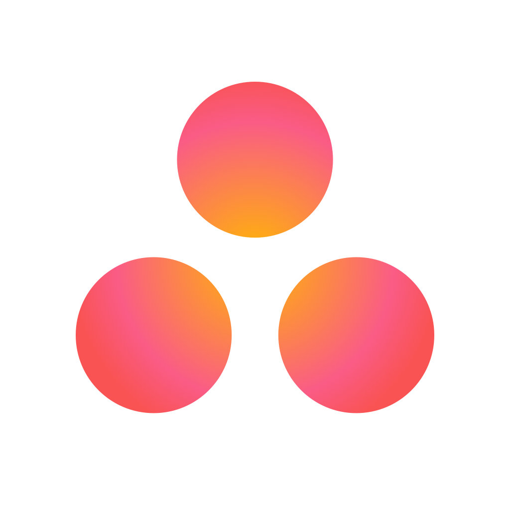
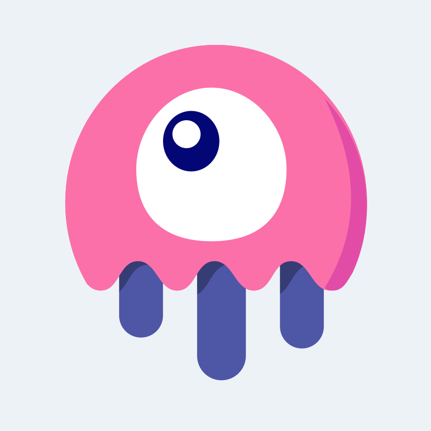
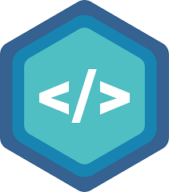

<article class="markdown-body entry-content container-lg f5" itemprop="text">
    

        

            
        

        <h3 dir="auto">I love to code👨‍💻</h3>
        

            <a href="https://instagram.com/fckinastronaut" rel="nofollow">
                Instagram
                
            </a>
            <a href="https://itsrianalfa.space" rel="nofollow" style="margin-left: 16px;">
                Website
                
            </a>
        

    

    <h2 dir="auto">
        
        About Me
    </h2>
    <h5 dir="auto" style="font-weight: 'bold';">
        Hi, I'm Rian Alfa. I'm a very talented problem solver with so many experiences in vast range of disciplines, manager, leader, advisor, full-stack developer, music enthusiast, photographer and more.
    </h5>
    

        Though I've just graduated from college in 2022, I have taken parts in so many projects around the topic of education platforms. I've built a lot of web-based education platforms which mostly has an exam-like feature that they offer. I thrive on challenges and constantly setting goals for myself, so I have something to strive for. I always do my best in every opportunity I get. During my college year, I participated in several organizations and committees and contributed to the field of information technology, both as a coordinator and as a member. I created an internal organization website, a dashboard to visualize the documentary of the activities, an a forum for the participants to communicate.
    

    <h2 dir="auto">
        
        Programming Languages, Frameworks, & Tools I Use
    </h2>
    

        
        
        
        
        
        
        
        
        
        
        
        
        
        
        
        
    

</article>